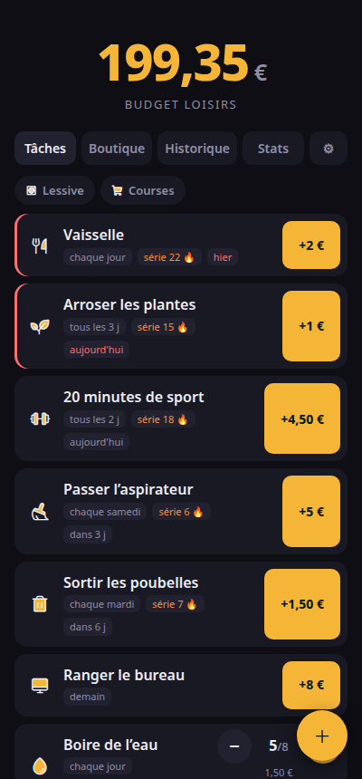
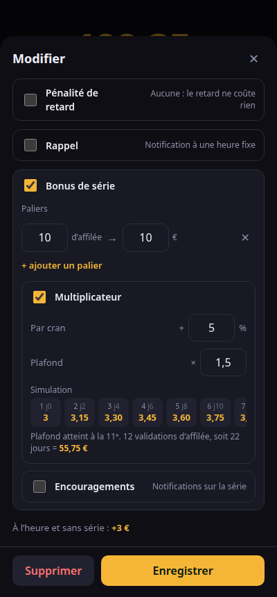
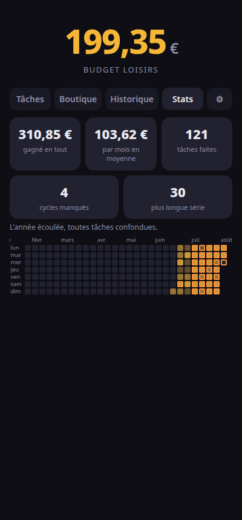
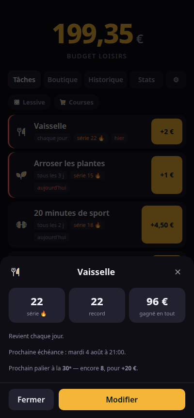
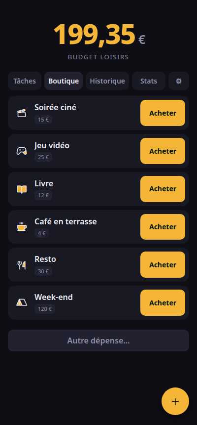
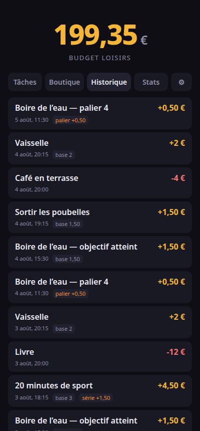

# Butineur

Turn chores into a **fun-money budget**.

The idea: every task you complete pays out an amount you set yourself. It is not
real money — it is a spending allowance you grant yourself for leisure. Cleaning
the kitchen funds a night at the movies.

*[Lire en français](README.fr.md)*

<p align="center">
  
  
  
</p>

<p align="center">
  
  
  
</p>

<p align="center"><em>Screenshots taken on demo data — <code>npm run screenshots</code>. The
interface is in French for now; see <a href="#status">Status</a>.</em></p>

## What it does

- **Free-form rewards** — you set the amount of every task.
- **Repeating tasks** — once every X days.
- **Counter tasks** — "drink 8 glasses of water a day", with reward tiers.
- **Deadlines** — penalty of your choice: none, flat amount, percentage, or
  decreasing per day late. A late task pays less, never below zero.
- **Streak bonus** — tiers ("7 days in a row = +20") and a capped multiplier, which
  stack. The editor simulates the result before you commit to it.
- **Shop** — your leisure items with their price, bought in one tap, plus a
  free-form amount.
- **Home screen widgets** — the balance, a configurable counter, and the list of
  tasks you can complete without opening the app.
- **Small animations** on every gain and every purchase, dropped when the system
  asks for reduced motion.

## How it is built

A single web codebase (React + Vite) serving both as an Android app — through
Capacitor — and as a site you can open in a browser. The only native code is the
widgets, in Kotlin, because Android cannot render web content on the home screen.

**The balance is never stored.** It is recomputed by replaying an append-only
event log (`src/engine.ts`). Two consequences:

- two devices holding the same events necessarily show the same balance, without
  a single line of conflict resolution;
- a widget is just a third device that only knows how to append facts. Tapping
  "+1" with the app closed stacks a fact, which the app pours into the log on its
  next start — with the timestamp of the tap, so no unearned late penalty.

No background service: the widgets read the `SharedPreferences` file that
`@capacitor/preferences` already writes.

## Development

```bash
npm install
npm run dev          # browser
npm run test         # the reward engine (the money path)
npm run android      # build + install on the plugged-in phone
npm run android:apk  # APK only, no device needed
npm run screenshots  # the README screenshots, on demo data
```

`npm run screenshots` needs the dev server (`npm run dev`) and
`chromium-browser`. It writes a set of fake tasks into a throwaway session —
never your real data.

Android prerequisites: a JDK 21 and the Android SDK. `android/local.properties`
and the script's `JAVA_HOME` point at one specific machine — adapt them.

## Status

Working on Android. The optional self-hosted server (browser access from a
desktop, and phone ↔ desktop sync) is designed but not written yet: the event log
was built for it.

The interface is in French. An English translation is planned, and English will
become the default language.

## Contributing

Bug reports and ideas go through
[issues](https://github.com/Chachigo/butineur/issues) — see
[CONTRIBUTING.md](CONTRIBUTING.md). Butineur is a personal app with opinions:
open an issue before writing a pull request.

## License

[AGPL-3.0-only](LICENSE). Third-party material is listed in [NOTICE](NOTICE).

## Credits

The bee in the app icon comes from
[Noto Emoji](https://github.com/googlefonts/noto-emoji) (Google, Apache 2.0),
converted to a `VectorDrawable` by `scripts/svg-to-vector.mjs`. The task icons
come from [Phosphor](https://phosphoricons.com/) (MIT).
