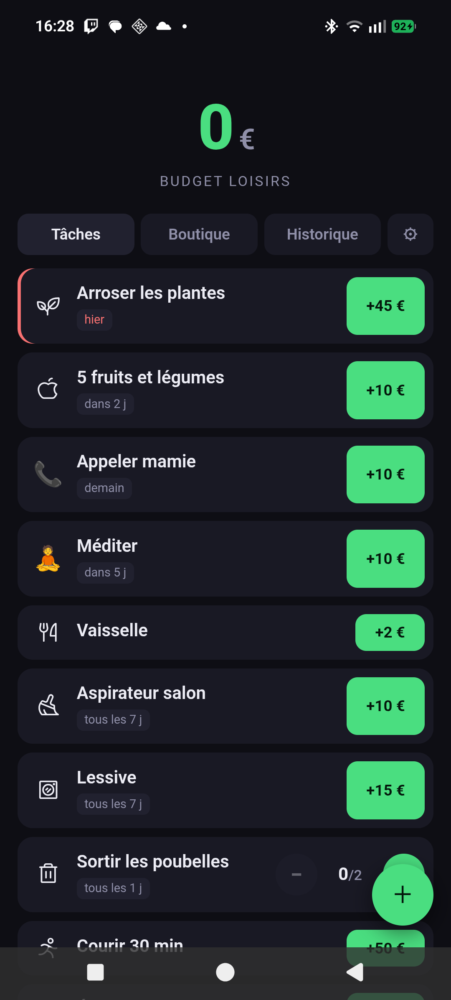
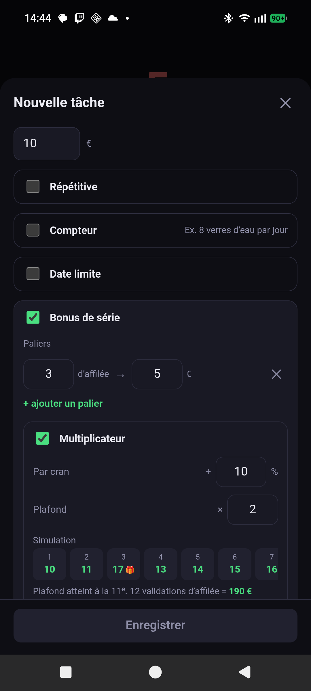

# Butineur

Gamifier ses tâches pour se constituer un **budget loisirs**.

L'idée : chaque tâche accomplie rapporte une somme que tu as définie toi-même.
Ce n'est pas de l'argent réel — c'est une enveloppe de dépense que tu t'autorises
ensuite pour tes loisirs. Faire le ménage finance une soirée ciné.

<p align="center">
  
  
</p>

## Ce que ça fait

- **Récompenses libres** — tu fixes le montant de chaque tâche.
- **Tâches répétitives** — une fois tous les X jours.
- **Tâches à compteur** — « boire 8 verres d'eau par jour », avec paliers de récompense.
- **Dates limites** — pénalité au choix : aucune, montant fixe, pourcentage, ou
  dégressive par jour de retard. Une tâche en retard rapporte moins, jamais rien de négatif.
- **Bonus de série** — paliers (« 7 jours d'affilée = +20 ») et multiplicateur plafonné,
  cumulables. L'éditeur simule le résultat avant que tu valides.
- **Boutique** — tes loisirs avec leur prix, achetables en un tap, plus un montant libre.
- **Widgets d'écran d'accueil** — le solde, un compteur paramétrable, et la liste des
  tâches validables sans ouvrir l'appli.
- **Petites animations** à chaque gain et à chaque dépense, coupées si le système
  demande des animations réduites.

## Comment c'est fait

Un seul codebase web (React + Vite) qui sert à la fois d'appli Android — via
Capacitor — et de site consultable au navigateur. Le seul code natif est celui
des widgets, en Kotlin, parce qu'Android ne sait pas afficher du web sur l'écran
d'accueil.

**Le solde n'est jamais stocké.** Il est recalculé en rejouant un journal
d'événements append-only (`src/engine.ts`). Deux conséquences :

- deux appareils qui ont les mêmes événements affichent forcément le même solde,
  sans une ligne de résolution de conflit ;
- un widget est simplement un troisième appareil qui ne sait qu'ajouter des faits.
  Taper « +1 » appli fermée empile un fait, que l'appli verse au journal à sa
  prochaine ouverture — avec l'horodatage du tap, donc sans pénalité de retard
  injustifiée.

Aucun service en arrière-plan : les widgets lisent le fichier `SharedPreferences`
que `@capacitor/preferences` écrit déjà.

## Développement

```bash
npm install
npm run dev          # navigateur
npm run test         # le moteur de récompenses (chemin argent)
npm run android      # build + installe sur le téléphone branché
npm run android:apk  # APK seul, sans appareil
```

Prérequis Android : un JDK 21 et le SDK Android. `android/local.properties` et le
`JAVA_HOME` du script pointent vers une machine précise — à adapter.

## État

Fonctionnel sur Android. Le serveur self-host optionnel (accès PC au navigateur et
synchronisation téléphone ↔ PC) est conçu mais pas encore écrit : le journal
d'événements est fait pour ça.

L'interface est en français. Une traduction anglaise est prévue, et l'anglais
deviendra la langue par défaut.

## Crédits

L'abeille de l'icône vient de [Noto Emoji](https://github.com/googlefonts/noto-emoji)
(Google, Apache 2.0), convertie en `VectorDrawable` par `scripts/svg-to-vector.mjs`.
Les icônes de tâches viennent de [Phosphor](https://phosphoricons.com/) (MIT).
